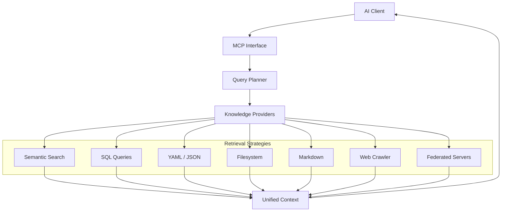

# Agentoom Knowledge

Agentoom Knowledge is a self-hosted Knowledge Server that exposes trusted enterprise context through the Model Context Protocol (MCP). It provides a unified retrieval layer over heterogeneous knowledge sources, ensuring that AI agents receive the most relevant context without needing to understand the underlying infrastructure.

> **Knowledge is heterogeneous. Retrieval should be too.**

📖 **[Read the full article →](ARTICLE.md)** &nbsp;|&nbsp; 🚀 **[Installation Guide →](docs/INSTALLATION.md)** &nbsp;|&nbsp; 📚 **[How to Use →](docs/HOW_TO_USE.md)** &nbsp;|&nbsp; 🔌 **[Extending →](docs/EXTENDING.md)**

---

## The Problem

Enterprise knowledge is inherently heterogeneous. It lives in fragmented systems, each optimized for a specific purpose:

*   **Documentation and Policies** reside in Markdown or PDF files.
*   **Customer and Order Data** live in relational SQL databases.
*   **Invoices and Receipts** are stored as structured documents.
*   **System Configurations** are managed in YAML or JSON.
*   **External APIs** provide real-time state from third-party services.

Current AI retrieval systems often attempt to force these diverse sources into a single strategy. Some systems convert everything into vectors for semantic search, losing the precision of structured data. Others attempt to model everything as a graph, introducing unnecessary complexity for simple document retrieval.

While each strategy—semantic search, SQL queries, or API calls—is excellent within its own domain, no single strategy is optimal for every type of knowledge.

## Philosophy

Agentoom Knowledge is built on the principle that the retrieval strategy should match the nature of the knowledge. 

Our goal is not to replace RAG, SQL, knowledge graphs, or APIs. Instead, the goal is to orchestrate them. Agentoom Knowledge acts as a deterministic abstraction layer that selects the most appropriate retrieval strategy for each query.

By separating the **request for information** from the **execution of retrieval**, we ensure that AI models remain focused on reasoning while the infrastructure handles the complexity of context gathering.

## The Solution

Agentoom Knowledge is a **self-hosted Knowledge Server** designed for the enterprise. It exposes a trusted context window to AI agents via the **Model Context Protocol (MCP)**.

Unlike orchestration frameworks that mix logic with retrieval, Agentoom Knowledge is focused purely on **trusted context**. The AI should never care whether a piece of information came from a vector database, a legacy SQL table, or a cloud API. It simply receives the unified context it needs to perform its task.

## The Query Planner

At the heart of Agentoom Knowledge is the **Query Planner**. Inspired by database query optimizers, the planner is responsible for decomposing a context request into a set of executable tasks.

The Query Planner is **deterministic** and does **not** rely on an LLM for its core logic. This design choice provides several critical advantages:

*   **Predictability:** The same request will always result in the same retrieval plan.
*   **Explainability:** Every step of the retrieval process can be audited and understood.
*   **Performance:** Deterministic planning has significantly lower latency than LLM-based reasoning.
*   **Cost Efficiency:** No token costs are incurred during the planning phase.

The planner identifies which knowledge providers are relevant to a query, executes them in parallel or sequence, and merges the results into a coherent, ranked context window.

### How It Works

The planning process follows a deterministic, multi-step pipeline:

1.  **Query Analysis:** The planner receives a request containing the search query, optional namespaces, and requested search types (e.g., semantic or structured).
2.  **Provider Discovery:** It consults the **Metadata Registry** to identify all registered knowledge providers that match the query's scope.
3.  **Capability-aware Routing:** For each relevant provider, the planner determines the optimal operation based on the provider's capabilities. If a specific search type is requested and supported, it is prioritized; otherwise, it defaults to a general search.
4.  **Execution Planning:** A structured **Execution Plan** is generated, consisting of discrete steps for each provider. Each step includes the specific parameters and operations needed.
5.  **Parallel Execution:** The **Retrieval Engine** takes the plan and executes all steps in parallel using Laravel's concurrency features, ensuring that slow providers don't block the entire request.
6.  **Result Fusion:** Finally, results from all providers are merged using **Reciprocal Rank Fusion (RRF)**. This ensures that the most relevant information from diverse sources (e.g., a SQL table and a vector index) is ranked appropriately in the final context window.

### Handling Conflicts, Priority, and Freshness

To ensure the context window is both accurate and authoritative, the Query Planner employs several advanced strategies:

#### Conflicting Information
The planner does not attempt to "resolve" factual conflicts at the retrieval layer. Instead, it uses **Reciprocal Rank Fusion (RRF)** to score snippets based on their consistency and relevance across multiple sources.
*   **Deduplication:** Results are keyed by content hash or unique ID. Identical information from different sources is merged, increasing its overall rank.
*   **Contextual Diversity:** When sources disagree, the planner preserves the conflicting perspectives in the final context. This allows the AI agent to see the "full picture" and apply its own reasoning to the evidence provided.

#### Source Priority & Authority
Not all knowledge is equal. The Query Planner respects the **Source Priority** defined in the Metadata Registry:
*   **Weighted Planning:** The planner sorts execution steps based on the priority of the underlying Knowledge Source. High-priority sources (e.g., Official Policies) are prioritized in the execution plan over lower-priority sources (e.g., Community Wikis).
*   **Namespace Isolation:** Authority is further enforced through Namespaces. By scoping queries to specific namespaces, users can ensure that only vetted, authoritative providers are consulted for sensitive requests.

#### Real-time vs. Cached Data
Agentoom Knowledge balances the speed of indexed search with the accuracy of live data:
*   **Hybrid Execution:** The system simultaneously queries real-time providers (SQL, Filesystems) and indexed providers (Typesense).
*   **Discovery Caching:** While retrieval is often real-time, the **Metadata Registry** is cached. This ensures the planner can identify the best sources in milliseconds without hitting the database on every request.
*   **Parallel Resilience:** By using Laravel's concurrency layer, the planner ensures that slow real-time lookups (like a complex SQL join) do not delay the delivery of faster cached results.

## Retrieval Philosophy

Agentoom Knowledge combines retrieval strategies rather than forcing a "one size fits all" approach.

| Knowledge               | Retrieval Strategy | Provider Class         |
| ----------------------- | ------------------ | ---------------------- |
| Documentation / Manuals | Semantic Search    | `VectorStore\SemanticProvider`  |
| Web Content             | Semantic Search    | `VectorStore\SemanticProvider`  |
| Multi-format Files      | Full-text Scan    | `Filesystem\FilesystemProvider` |
| Markdown Files          | Full-text Scan    | `Markdown\MarkdownProvider`     |
| SQL Databases           | Structured Query  | `Sql\SqlProvider`              |
| YAML Configuration      | Structured Query  | `Yaml\YamlProvider`             |
| JSON Data               | Structured Query  | `Json\JsonProvider`             |
| Websites                | HTTP Fetch + Parse| `Web\WebProvider`               |

## Architecture

Agentoom Knowledge follows a deterministic flow from client request to context delivery.



## Implementation Details

### Embedding Generation
Agentoom Knowledge uses **Managed Embeddings** handled internally by the vector store (Typesense). 
*   **Internal Processing:** When a document is processed by the `DocumentPipeline`, the `IndexChunk` job sends raw text content to Typesense.
*   **No External Latency:** By offloading vectorization to Typesense's built-in machine learning capabilities, the system avoids the latency, cost, and privacy concerns associated with calling external services like OpenAI or Cohere during the indexing loop.
*   **Consistency:** This ensures that the same model is used for both indexing and query vectorization, maintained entirely within your self-hosted infrastructure.

### Typesense Schema Management
The system avoids the complexity of mapping diverse enterprise schemas into a vector store by using a **Hybrid Storage Strategy**:
*   **Unified Document Index:** Unstructured data (Markdown, PDFs, etc.) is parsed and decomposed into a unified `knowledge_chunks` collection. This collection uses a fixed, flattened schema that includes content, sequence, and source metadata.
*   **Native Structured Retrieval:** For SQL databases and YAML structures, the system does **not** attempt to force them into Typesense collections. Instead, the `SqlProvider` and `YamlProvider` query the source data natively and in real-time.
*   **Precision over Flattening:** This approach preserves the relational integrity and precision of structured data while allowing semantic search to operate on the types of knowledge where it excels (documentation and prose).

### Authentication & Authorization
Security is a first-class citizen in Agentoom Knowledge, especially given the sensitivity of enterprise data:
*   **MCP API Guard:** All requests to the MCP server are protected by a custom `mcp_api` authentication guard.
*   **API Keys:** Access is managed through API Keys with granular scopes (e.g., `mcp:use`, `admin:*`). These keys must be provided as Bearer tokens in the MCP connection.
*   **Multi-tenancy Ready:** While currently focused on single-instance enterprise deployment, the core data models (`KnowledgeSource`, `Provider`, `Document`, `ApiKey`) include `tenant_id` columns with foreign key constraints, ensuring that future multi-tenant deployments have logical isolation at the database and retrieval layers.

### Lifecycle Automation & Syncing
The system handles the complexity of keeping knowledge sources in sync through an automated lifecycle:
*   **Source Observers:** When a `KnowledgeSource` is created or updated in the Admin panel, Eloquent Observers automatically manage the underlying `Provider` models and their technical configurations.
*   **Pipeline Orchestration:** New documents are automatically routed through a multi-stage pipeline (Discover → Parse → Normalize → Chunk → Enrich → Index) via batched queue jobs.
*   **Artisan Commands:** `knowledge:pipeline:run` triggers document discovery and processing for active sources.

### Observability & The Search Playground
Agentoom Knowledge provides deep visibility into its "black box" retrieval logic:
*   **Retrieval Logging:** Every request processed by the engine is logged with its full query, deterministic execution plan, fused results, and precise latency metrics.
*   **Search Playground:** An interactive internal tool allows administrators to simulate agent requests. It visualizes the **Reasoning** (the step-by-step execution plan) alongside the **Evidence** (the final ranked results), making it easy to debug retrieval quality.
*   **Performance Metrics:** The dashboard tracks real-time health, including Horizon queue status and vector store (Typesense) metrics, ensuring the system remains responsive under load.

### Federation
Agentoom Knowledge servers can be federated so that a single instance queries multiple servers transparently:
*   **FederatedServer Model:** Each remote server is registered with an endpoint URL, encrypted API token, and priority.
*   **FederationPlanner:** Extends the query planner to include federation steps alongside local providers. Local results take priority; remote results augment with lower rank weight.
*   **FederationProvider:** Acts as an MCP client — translates local `SearchQuery` objects into JSON-RPC `tools/call` requests to the remote server's `search_knowledge` endpoint. Results are tagged with `_federation_source` for traceability.
*   **Result Fusion:** Remote results are fused with local results via RRF, so the AI receives a single unified context window regardless of how many servers contributed.
*   **Admin UI:** Full CRUD for federation servers with connection testing and remote capability syncing.

### Chunking Strategies
The document pipeline uses content-type-aware chunking to preserve semantic meaning:
*   **MarkdownChunking:** Heading-aware splitting — splits on `#` headers, falls back to paragraph boundaries.
*   **SemanticChunking:** Paragraph and sentence boundary detection — produces coherent chunks that never break mid-thought.
*   **SlidingWindowChunking:** Overlapping windows for code and structured data — ensures no context is lost at chunk boundaries.
*   **FixedSizeChunking:** Character-based with word-boundary respect — the safe fallback.

The `ChunkingStrategyRegistry` automatically selects the best strategy based on MIME type and file extension.

### Web Provider & Crawling
The `WebProvider` fetches and converts content from configured URLs into searchable Markdown via `league/html-to-markdown`. For larger documentation sites, it supports **recursive crawling**:

- **Crawl Configuration:** Set `max_depth`, `max_pages`, `allowed_domains`, and `politeness_delay_ms` per source.
- **Robots.txt Compliance:** The `RobotsTxt` utility fetches and caches `robots.txt` rules, respecting `Disallow` directives per user agent.
- **Content Extraction:** Navigation, footers, headers, scripts, and styles are stripped before Markdown conversion, leaving clean, structured text.
- **Recursive Discovery:** The `CrawlWebSource` job discovers `<a href>` links from each page and dispatches child jobs for the next depth level, respecting domain and pattern exclusions.
- **Batched Processing:** Each crawled page is stored as a `Document` and flows through the standard parsing/chunking/indexing pipeline.

## Features

- **Self-hosted:** Total control over your data and infrastructure — runs on Docker.
- **MCP Server:** Native Model Context Protocol endpoint with `search_knowledge`, `list_sources`, and `get_source_schema` tools.
- **Deterministic Query Planner:** Reliable, auditable retrieval — no LLM in the retrieval path. Federation-aware: queries local and remote servers transparently.
- **Hybrid Providers:** Filesystem (multi-format), Markdown, SQL, YAML, JSON, Web, Vector (Typesense), and Federation providers built in. Each provider searches in its native format — YAML returns key-value hits, SQL returns row results, Markdown uses heading-aware chunking. All filesystem-backed providers support UI uploads via a built-in file manager.
- **Recursive Web Crawling:** Domain-scoped crawling with configurable depth, politeness, robots.txt compliance, and link exclusion patterns — ingested straight into the document pipeline.
- **HTML-to-Markdown:** Web content and crawled pages are converted to clean Markdown via `league/html-to-markdown`, preserving headings, lists, code blocks, and links.
- **Advanced Chunking:** Four chunking strategies (Semantic, Sliding Window, Markdown, Fixed Size) with content-type-aware auto-selection.
- **Reciprocal Rank Fusion:** Results from multiple providers merged and deduplicated by rank.
- **Metadata Registry:** Centralized, cached registry of all knowledge source capabilities and schemas.
- **Document Pipeline:** Automated multi-stage pipeline (Discover → Parse → Chunk → Enrich → Index).
- **MCP Federation:** Connect multiple Agentoom Knowledge servers together — queries execute across all federated peers with unified result fusion.
- **Provider SDK:** Extensible architecture with 10 contracts, `make:knowledge-provider` generator, auto-discovery via config, and full extension guide.
- **Admin UI:** Livewire + Flux admin panel for managing sources, providers, federation servers, users, and settings.
- **Retrieval Logging:** Full audit trail with query text, execution plans, fused results, and latency.
- **Search Playground:** Interactive sandbox to test queries and visualize retrieval plans in real time.
- **Danger Zone Reset:** One-click app reset from Settings — clears all knowledge data, search indexes, and logs while preserving users and configuration.
- **API Key Auth:** Scoped API key authentication for MCP access with separate user/service-account keys and prefix-optimized lookups.
- **Horizon Queues:** Background indexing and document processing via Redis queues.
- **Apache Tika Integration:** Robust parsing for hundreds of document formats (PDF, DOCX, etc.).
- **Passkeys + 2FA:** Fortify-powered authentication with passkeys and TOTP two-factor auth.
- **Role-based Access:** Admin, Operator, and Viewer roles for UI authorization.

## Why Laravel?

Agentoom Knowledge is implemented using the Laravel framework. We chose Laravel because it is the premier ecosystem for building robust, maintainable infrastructure.

While Python is the standard for training AI models, this project is about **orchestration and infrastructure**. Laravel excels in the areas that matter most for a Knowledge Server:

*   **Orchestration:** Powerful dependency injection and service container.
*   **Reliability:** Mature queue systems (Horizon) and event broadcasting.
*   **Extensibility:** A world-class package ecosystem and clean architectural patterns.
*   **Administration:** Elegant tools for building secure, intuitive management interfaces.
*   **Integration:** Seamless handling of databases, filesystems, and external APIs.

By leveraging Laravel, we provide a stable, scalable foundation that enterprise engineers can trust and contribute to.

## What This Project Is NOT

To maintain a focused vision, it is important to define what Agentoom Knowledge is not:

*   ❌ **AI Agent Framework:** We provide context; we don't build the agents.
*   ❌ **Workflow Engine:** We don't manage complex multi-step AI business logic.
*   ❌ **Prompt Library:** We focus on data retrieval, not prompt engineering.
*   ❌ **LLM Wrapper:** We are a standalone infrastructure component.
*   ❌ **Vector Database:** We integrate with vector stores but provide much more.
*   ❌ **Graph Database:** We are a retrieval layer, not a primary storage engine.
*   ❌ **AI Model:** we do not train or host LLMs.
*   ❌ **RAG Framework:** We are a complete Knowledge Server, not just a library.

## Installation

See the **[Installation Guide](docs/INSTALLATION.md)** for step-by-step setup instructions covering both development and production environments.

For day-to-day usage after installation, see the **[How to Use](docs/HOW_TO_USE.md)** guide. To build custom providers, see the **[Extending](docs/EXTENDING.md)** guide.

### Prerequisites

- [Docker](https://docs.docker.com/get-docker/) and Docker Compose
- [Laravel Sail](https://laravel.com/docs/sail) (included)

### Quick Start (Development)

```bash
git clone https://github.com/agentoom/knowledge.git
cd knowledge

# Copy and configure environment
cp .env.example .env

# Start Docker containers (PostgreSQL, Redis, Typesense)
vendor/bin/sail up -d

# Install dependencies
vendor/bin/sail composer install
vendor/bin/sail npm install

# Generate app key and run migrations
vendor/bin/sail artisan key:generate
vendor/bin/sail artisan migrate --seed

# Build frontend assets
vendor/bin/sail npm run build

# Start the dev server
vendor/bin/sail artisan serve
```

The application will be available at `http://localhost:8000`.

### Testing

A `.env.testing` file is provided with CI-friendly defaults (SQLite in-memory database, array cache and session drivers, sync queue). To run tests without Docker services:

```bash
cp .env.testing .env
vendor/bin/sail artisan test --compact
```

Note: some tests that exercise the vector store (Typesense) or Horizon will need Docker services running.

### Default Admin User

After seeding, log in with:
- **Email:** `admin@agentoom.com`
- **Password:** `changeme`

The seeder is idempotent — you can safely re-run `migrate --seed` without duplicate key errors.

### Queue Worker

For background document processing, start a queue worker:

```bash
vendor/bin/sail artisan horizon
```

## Screenshots

> Screenshots coming soon.

## Roadmap

- **Phase 1:** Core MCP implementation, basic SQL/Semantic providers. ✅
- **Phase 2:** Query Planner strategies, Reciprocal Rank Fusion, observability. ✅
- **Phase 3:** Web Provider, Document Pipeline automation, Admin UI. ✅
- **Phase 4:** Advanced chunking strategies, HTML-to-Markdown conversion, provider SDK formalization. ✅
- **Phase 5:** True web crawling (domain recursive), MCP federation. ✅
- **Phase 6:** Production hardening — Laravel scheduler for periodic maintenance (Horizon snapshots, federation sync, log pruning), rate limiting on the MCP API endpoint, health-check endpoint for Docker and load balancers, notification pipeline for sync failures and high-latency alerts.
- **Phase 7:** Search quality — hybrid keyword+vector search in Typesense, content deduplication via SHA-256 hashing in the parse stage, configurable synonym expansion for query rewriting, recency-aware scoring in Reciprocal Rank Fusion so fresher content surfaces higher.
- **Phase 8:** Provider completeness — external embedding provider implementation (OpenAI, Cohere, local HuggingFace) through the existing `EmbeddingProvider` contract, MCP resources for document and source browsing, **OCR fallback for images**: a local OCR engine (e.g., PaddleOCR) running in the same Docker stack that the pipeline calls only when Tika returns empty or near-empty content from image files (jpg, png, tiff, etc.), so image-based documents become searchable without external API dependencies. Non-image parsing stays on Tika; OCR is a targeted gap-filler, not a replacement.
- **Phase 9:** Enterprise features — activity/audit trail tracking who changed what (sources, API keys, settings), token-aware chunking that respects LLM context windows, retry/reprocess mechanism for documents stuck in `error` status after transient Tika failures, knowledge source templates for one-click setup of common configurations.
- **Phase 10:** Test coverage — dedicated tests for each provider (Yaml, Json, Markdown, Web, Sql), chunking strategy tests for all four strategies, Livewire component tests for Playground, ApiKeys, DangerZone, and Dashboard.
- **Phase 11:** Future horizons — knowledge graph traversal, semantic caching of retrieval results, multi-tenancy with row-level data isolation (schema already has `tenant_id` columns), fine-tuned embedding models for domain-specific knowledge, and additional OCR/parser improvements.

## Plugin Ecosystem

Agentoom Knowledge is designed to be extended. Its modular architecture allows developers to contribute to a growing ecosystem:

*   **Providers:** Add support for new data sources (e.g., Jira, Salesforce, Slack).
*   **Vector Stores:** Integrate with Pinecone, Milvus, or Weaviate.
*   **Embedding Providers:** Use OpenAI, Cohere, or local HuggingFace models.
*   **Planner Strategies:** Implement custom logic for specialized domain retrieval.
*   **Parsers:** Extend Apache Tika with specialized document extractors.

## Design Principles

1.  **Knowledge is heterogeneous. Retrieval should be too.** Strategy must match the data.
2.  **Deterministic over magical.** Prefer explainable logic over black-box LLM reasoning.
3.  **Infrastructure over framework.** Be a reliable component, not a restrictive cage.
4.  **Self-hosted first.** Privacy and data sovereignty are non-negotiable.
5.  **Open standards.** Build on MCP and other interoperable protocols.
6.  **Replaceable components.** Use Laravel Contracts to allow swapping any major driver.
7.  **Database-driven configuration.** Manage the system through UI and API, not just files.

## Future

The architecture of Agentoom Knowledge is built to support the next generation of AI infrastructure. See [Phase 11](#roadmap) for forward-looking items including knowledge graphs, semantic caching, multi-tenancy, and fine-tuned embeddings.

## Relationship with Agentoom

Agentoom Knowledge is extracted from the architecture behind Agentoom and released as a standalone open-source project because we believe the community benefits from a high-quality, self-hosted knowledge infrastructure that anyone can use.

---

## License

The Agentoom Knowledge server is open-source software licensed under the [MIT license](LICENSE.md).
